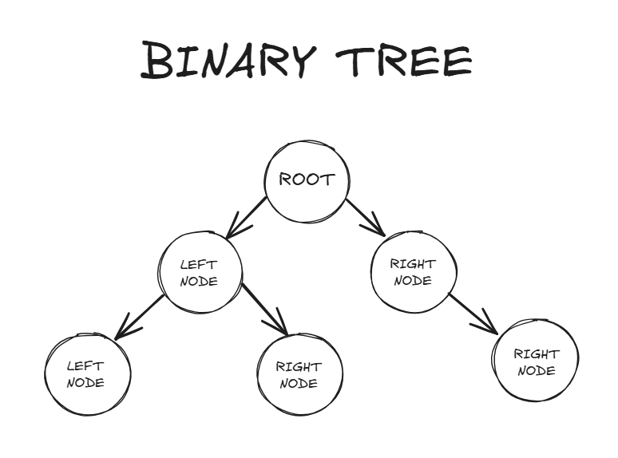

# BINARY TREE

## O que é?

Uma binary tree (árvore binária) é uma estrutura de dados hierárquica onde cada nó possui até dois nodes: um node à esquerda e um node à direita.

- Head: A informação armazenada no nó.
- Node esquerdo: Um ponteiro (ou referência) para o nó à esquerda, que é também uma árvore binária.
- Node direito: Um ponteiro para o nó à direita, que é também uma árvore binária.

