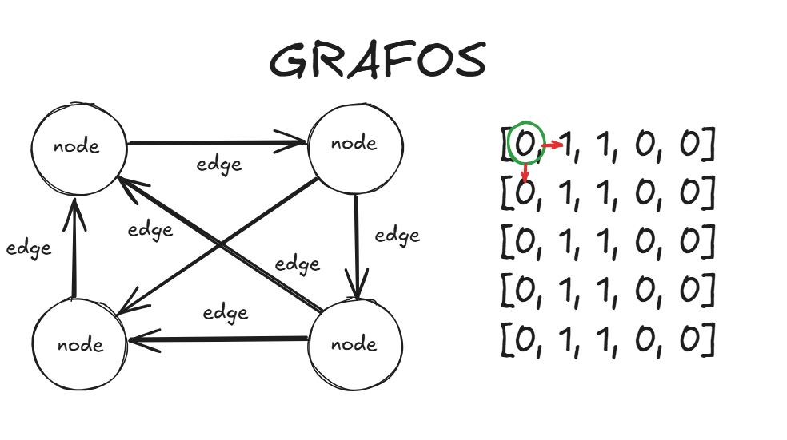

# GRAPHS

## O que é

Um grafo é uma estrutura de dados composta por nodes e edges, que conectam os nodes. Ele é usado para representar relações ou conexões entre objetos.

### Componentes principais

- Nodes: representam os objetos ou pontos no grafo.
- Edges: representam as conexões entre os nodes. Podem ser direcionadas ou não.

### Tipos de grafos

- Grafo não direcionado: As edges não têm direção. Ou seja, se há uma edge entre os nós A e B, você pode ir de A para B e de B para A.

- Grafo direcionado (ou dígrafo): As edges têm direção, ou seja, se há uma edge de A para B, não significa que você pode ir de B para A.

- Grafo ponderado: As edges têm um valor associado (peso), geralmente usado para representar custos ou distâncias.

- Grafo não ponderado: As edges não têm valores associados.

### Representações

- Matriz de Adjacência: Uma tabela bidimensional que mostra se há uma edge entre dois nodes.
- Lista de Adjacência: Para cada node, há uma lista de outros nodes aos quais ele está conectado.

### Aplicações

- Redes sociais (conexões entre pessoas)
- Navegação (mapas, rotas)
- Computação (fluxo de dados, redes de computadores)

