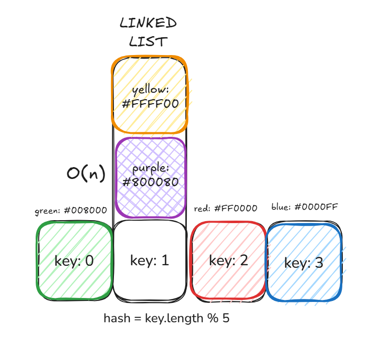

# HASHMAP

Um HashMap é uma estrutura de dados que mapeia uma chave (key) a um valor. Ele utiliza uma função de hash para transformar a chave em um índice, que determina a posição onde o valor correspondente será armazenado em um array. Isso permite buscas, inserções e remoções eficientes, geralmente com complexidade O(1) no caso médio e, no pior dos casos, a complexidade é O(n).

Em resumo, um hash map terá um array bastante grande e uma hash function (geralmente criptografia para fazer um hashing consistente). Quando houver colisões, ele lidará com elas transformando os itens que colidem em uma estrutura de dados.

Inserir, remover ou buscar um item: Geralmente muito rápido, O(1), porque você vai direto ao compartimento certo. Mas no pior caso, pode ser O(n) se muitos itens forem para o mesmo compartimento (colisões).

## Load Factor

O load factor mede o quão cheia está a tabela hash. É a diferença de tamanho entre a quantidade de dados que temos e a estrutura de dados.

### Importância do Load Factor
- Se for baixo (< 0.5), a tabela tem muito espaço vazio, desperdiçando memória.
- Se for alto (> 0.75 - 0.9), aumenta a chance de colisõe, tornando a busca e inserção mais lentas.
- Quando o load factor atinge um limite crítico (geralmente 0.75), a tabela hash é redimensionada (dobrando de tamanho, por exemplo) e a posição dos elementos é recalculada para manter a eficiência.

## Collisions

Ocorre quando duas ou mais chaves são convertidas para o mesmo índice na tabela hash. Isso acontece porque a função de hash não é perfeita e há um número limitado de posições no array.

### Como lidar com colisões

#### Encadeamento separado (chaining)

Armazenando os itens que colidem em uma [linked list](LINKED-LIST.md) dentro do mesmo índice.

**Exemplos**

`key: 0` (com valor green: #008000) é mapeado para o índice 0 (0 % 5 = 0).

`key: 1` (com valores yellow: #FFFF00 e purple: #800080) é mapeado para o índice 1 (1 % 5 = 1). Como há duas chaves para o mesmo índice, elas formam uma [linked list](LINKED-LIST.md) para resolver a colisão.

`key: 2` (com valor red: #FF0000) é mapeado para o índice 2 (2 % 5 = 2).

`key: 3` (com valor blue: #0000FF) é mapeado para o índice 3 (3 % 5 = 3).

#### Encadeamento aberto (open addressing)

Realocando os elementos para outras posições no array.

