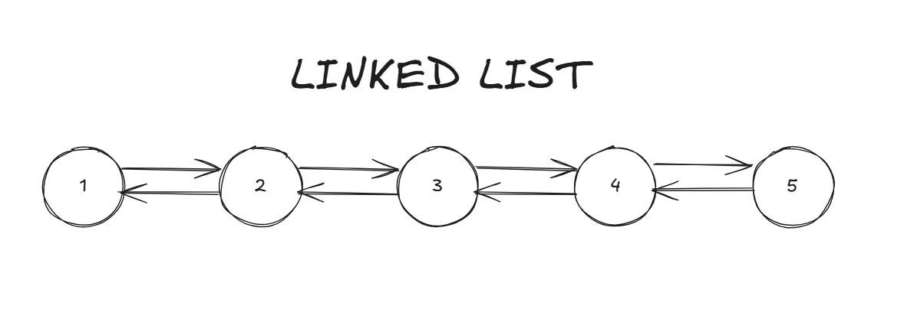

# LINKED LIST

## O que é?

Cada vagão no nó carrega um item e sabe quem é o próximo nó.
Para percorrer os itens, você começa na 'head' e vai percorrendo de nó em nó.

Em poucas palavras, sempre que eu preciso encontrar um elemento em uma linked list, o pior cenário se torna O(n), uma vez que terei que percorrer nó por nó até encontrar o desejado.

- Inserir ou remover no início: Muito rápido, O(1). Só inserir o novo item e alterar o ponteiro de "head" ou "tail"
- Acesso a um item específico: Lento, O(n), porque você precisa passar por cada nó até chegar ao que quer
- Inserir ou remover no meio ou no fim: Lento, O(n), porque você precisa percorrer a lista para chegar ao ponto desejado.

