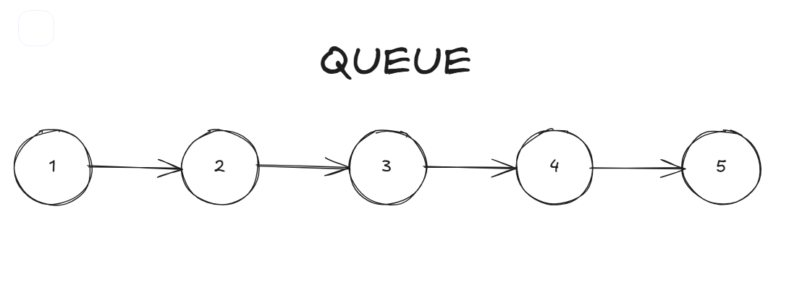

# QUEUE

## O que é

É uma estrutura de dados que segue o padrão FIFO (First In First Out), ou seja, o primeiro item que entrar na fila será o primeiro item a ser removido.

A implementação mais comum de uma queue é através de uma [linked list](LINKED-LIST.md) ou de um array, dependendo do caso de uso.

