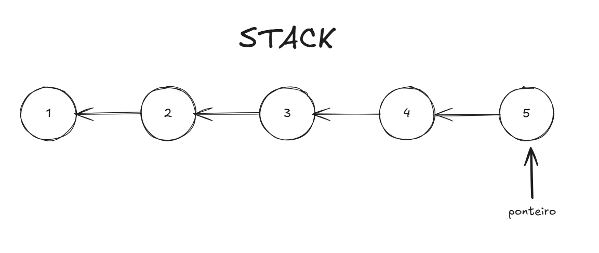

# STACK (pilha)

## O que é

A stack (pilha) é uma estrutura de dados que segue o princípio LIFO (Last In, First Out), ou seja, o último item inserido é o primeiro a ser removido. Ela pode ser comparada a uma pilha de pratos: você adiciona novos pratos no topo e retira o prato do topo quando precisar.

Pode ser implementada tanto como um array quanto como uma [linked list](LINKED-LIST.md).

