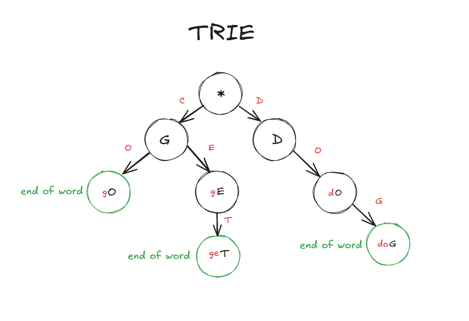

# TRIE

## O que é

É uma estrutura de dados especializada para armazenar um conjunto de strings de forma eficiente, especialmente quando há muitos prefixos em comum entre elas.

## Onde utilizar

Ela é utilizada para buscas rápidas em palavras ou frases, como em um sistema de autocomplete

